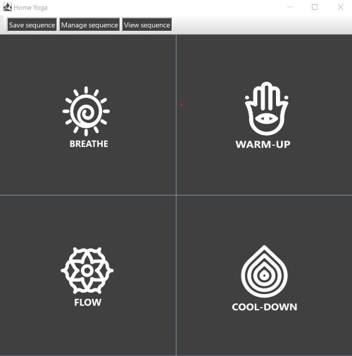
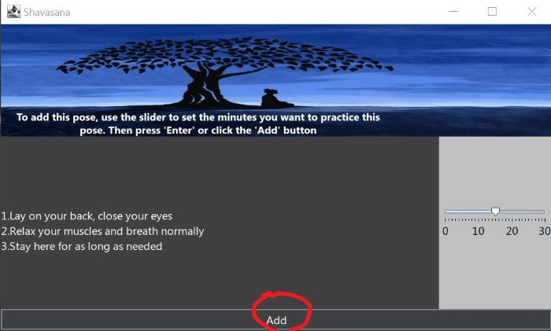
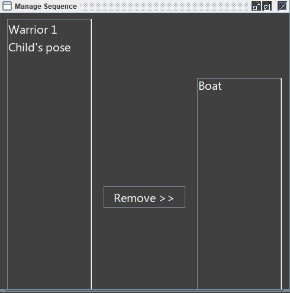

**Home Yoga**

*A sequence builder and tracker for yoga and poses*

**Description of Project**

The primary purpose of the app will be to enable users to browse yoga poses, view the pose description and add it to a list of poses to create a personalized yoga sequence. 
The poses will be categorized by stage of workout: breathing, warm-up, main and warm-down.
The target audience for the application is people who currently practice or are interested in starting a yoga practice.
 This project is of particular interest to me because I practice yoga regularly and know that it can be intimidating to start of with and may be difficult to make time to practice.
 This application would enable users to customize their routine based on the amount of time they have available.

**User Stories**

-As a user I want to be able to allocate how long I want to work out for.

-As a user, I want to be able to browse poses suitable for different stages of a workout and view their descriptions

-As a user, I want to be able to add a pose to my sequence and set the time I want to practice the pose for

-As a user, I want to be able to remove poses I no longer want and see an updated list and time remaining to allocate each time I add or remove a pose

-As a user, I want to be able to choose to save my sequence when I exit

-As a user, I want my saved sequence to reload once I re-open the app

**Phase 4 Task 2**

I chose to design a robust class

The YogaSequence class in the model package is robust, the tests are in the YogaSequenceTest class in test package. 

The addPose methods throws the following exceptions:

1. Duplicate pose exception - we want to maintain the order of the sequence but don't want duplicates so created 
a duplicate pose exception to alert the user of the duplicate. It is caught in the PoseAdder class of the GUI. 

2. Out of time exception - we don't want to add more poses to the sequence once all the allocated time has been assigned 
so created an out of time exception to alert the user that all the time has been assigned. It is caught in the PoseAdder
class of the GUI.

**Phase 4 Task 3**

*Increasing cohesion*

1. Previously, my MainMenu class was displaying all the components of the menu, had methods to manage
the sequence, view the sequence and save the sequence. I created the following new classes to divide the responsibilities:
SequenceSaver, SequenceViewer and SequenceManager.

2. My PoseAdder class was previously adding poses to the sequence and setting the time for each pose, I created the TimeSetter
class to handle setting the time for each individual pose and kept the adding functionality in the PoseAdder.

3. Created  IconCreator and DialogCreator classes to create icons and dialog popUps as multiple other classes in the 
GUI were individually handling these responsibilities so factored it into one class instead. 

*Reducing coupling*

 Previously, most classes in my GUI were associated with both the YogaPose and YogaSequence classes.
I removed the redundant associations to YogaPose from these classes since YogaSequence is already associated with YogaPose.
As well, now only the App class is associated with the YogaSequence class and provides sequence functionality to other 
classes.

Note: could not apply singleton pattern to YogaSequence directly, as private constructor prevented deserialization by
Jackson.

**Phase 3: Instructions for Grader**

**General navigation:**
- The welcome screen has a drop down menu to select the total amount of time you want to work out for

-You will then reach the main menu shown below. The 4 JButtons in the centre correspond to each stage of the yoga
practice, when clicked, poses suitable to that stage will be displayed. There are also 3 other buttons on top where
the user can save, view their sequence or manage their sequence.

**Requirement 1:**

Once you select a pose to view its description you will reach a screen similar to the one below:

Event 1: Drag the slider to set the time, then the circled 'Add' button responds to either the 'Enter' key **or** a  click 
to add the pose(X) to the sequence(Y)

To remove a pose from your sequence, click the 'Manage Sequence' button on the main menu, you will get to this screen:

Event 2: To remove a pose, you can select the pose you want to remove from the scroll pane, and click the remove button
to remove it

**Requirement 2:**

-For the visual component, I have added an app icon in the welcome screen, button icons on my stage buttons in the main menu,
a banner in the window for pose details and an image in the pop up when the 'Add' button is pressed

-For the audio component, once you set a time and hit the 'Add' button showed in the third image above, a bell sound will be played
to indicate a successful add

**Requirement 3**

-To save the sequence, click on the save button at the top of the main menu. Please note that it will not automatically
save on close, the save button must be clicked

-The sequence will reload automatically once the app is opened again, to check you can click the view sequence/ manage 
sequence button on the main menu to see all the loaded poses. I did not think a separate load button would make sense
in this situation- instructor confirmed on piazza save button only is sufficient (question @1017, @1160)

NOTES TO GRADER: 

1.The screenshots above show what the app looks like on a Windows computer and looks quite different on 
a Mac- apologies if anything is hard to see depending on which you are using.

2. The view sequence button only works when you have at least one pose to a sequence

